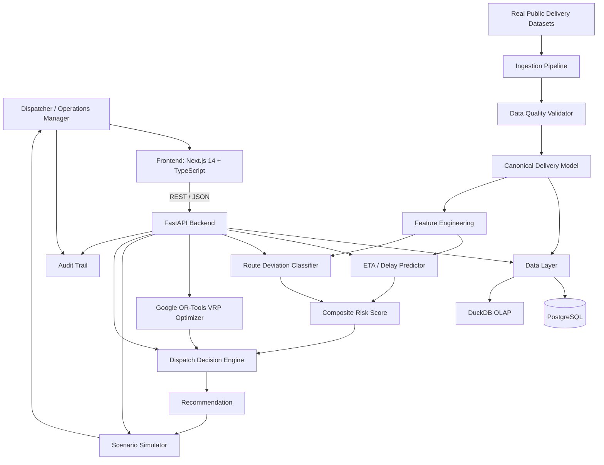

# Pathfinder — AI-Powered Last-Mile Delivery Intelligence

> A logistics decision platform that compares planned vs actual delivery routes, predicts delay risk using supervised ML, solves VRP with Google OR-Tools, and runs what-if scenario simulations — all inside a human-in-the-loop dispatcher workflow.

[](https://www.python.org/)
[](https://fastapi.tiangolo.com/)
[](https://nextjs.org/)
[](https://developers.google.com/optimization)
[](https://github.com/omkark2404/Pathfinder--AI-Powered-Last-Mile-Delivery-Decision-Intelligence/actions)
[](LICENSE)

---

## 1. Problem Statement

Last-mile delivery is the most expensive and operationally uncertain segment of logistics. Dispatchers typically face:

- High travel-time variance causing SLA breaches
- Drivers deviating from planned stop sequences without explanation
- No route-level risk visibility before failures compound
- No system connecting prediction → optimization → recommended action in one workflow

Most dispatch tools show telemetry. This system answers: **which route is at risk, why, and what should the dispatcher do about it?**

---

## 2. Core Loop

```
OBSERVE → PREDICT → DIAGNOSE → OPTIMIZE → SIMULATE → DECIDE → AUDIT
```

| Module | What it does |
|---|---|
| **Delivery Risk** | Predicts late delivery risk and computes a composite 0–100 risk score |
| **Route Intelligence** | Compares planned vs actual stop sequences; computes Kendall Tau similarity |
| **Dispatch Decisions** | Generates ranked operational actions (MONITOR / RESEQUENCE / REROUTE / ESCALATE) |
| **VRP Optimization** | Solves route sequencing using Google OR-Tools with time-window constraints |
| **Scenario Simulator** | Lets dispatchers run what-if scenarios before committing to a change |

---

## 3. Architecture



### Why ML + OR-Tools (not an LLM)?

- **ML** predicts uncertain outcomes (delay probability, deviation likelihood) from historical route features
- **Analytics** measures actual operational performance from real data
- **OR-Tools** searches deterministically for feasible alternative route sequences
- **Decision layer** combines prediction, operational constraints, and policy into a ranked recommendation

The ML model does not generate routes. Routes are generated by the constraint-aware VRP solver.

---

## 4. Real Datasets & Provenance

> **DATA MODE**: This application includes benchmark sample datasets committed out-of-the-box (`amazon_last_mile_sample.json` and `mendeley_planned_vs_actual.csv`), allowing the system to operate immediately in real data mode.
> If dataset files are removed, the system safely falls back to **`synthetic_demo`** mode using an in-memory test fixture clearly labeled `SYNTHETIC TEST FIXTURE — NOT REAL DELIVERY DATA`.

### Dataset A — Amazon Last Mile Routing Research Challenge

- **Source**: [AWS Open Data Registry](https://registry.opendata.aws/amazon-last-mile-challenges/)
- **Scope**: Historical driver routes across five U.S. metropolitan areas (2018).
- **Committed Benchmark Sample**: `data/amazon_last_mile_sample.json` (13 complete driver routes, 200+ stops, package dimensions, service times).
- **Full Dataset**: 9,184 historical driver routes available from AWS Open Data Registry.
- **License**: AWS Open Data
- **Usage in this system**: Route-level feature engineering, VRP constraint formulation, stop sequence benchmarking.
- **Note**: This is historical research data and does not represent current Amazon operations.

**Dataset setup**:
```bash
# A 13-route sample is already included at ./data/amazon_last_mile_sample.json
# To use the full 9,184-route dataset, download from AWS Open Data Registry and place at:
./data/amazon_last_mile.json
```

### Dataset B — Planned vs Actual Last-Mile Routes

- **Source**: [Mendeley Data](https://data.mendeley.com/datasets/kkwgfvmtxn)
- **DOI**: [https://doi.org/10.17632/kkwgfvmtxn.1](https://doi.org/10.17632/kkwgfvmtxn.1)
- **License**: CC BY 4.0
- **Committed Benchmark Dataset**: `data/mendeley_planned_vs_actual.csv` (30 routes, 603 stops).
- **Contents**: Planned route sequences vs actual driver sequences, travel distance, duration, time-window information.
- **Usage in this system**: Route deviation prediction, driver adherence analytics, Kendall Tau similarity index.
- **Note**: Real logistics-company data released for research.

**Dataset setup**:
```bash
# Benchmark dataset is already provided at:
./data/mendeley_planned_vs_actual.csv
```

---

## 5. Key Technical Components

### ETA / Delay Prediction
- **Model**: `GradientBoostingRegressor` (sklearn) vs Linear Regression baseline
- **Target**: `delay_minutes` (continuous)
- **Features** (9, leakage-free): `stop_count`, `planned_distance_km`, `planned_duration_min`, `avg_stop_distance_km`, `avg_stop_duration_min`, `driver_adherence_rate`, `driver_historical_delay_min`, `time_window_pressure`, `route_complexity_score`
- **Leakage prevention**: `actual_distance_km`, `actual_duration_min`, `actual_arrival` are never used as features
- **Training**: Temporal split (earlier dates train, later dates test — no random shuffle on sequential records)

### Route Deviation Intelligence
- **Model**: `RandomForestClassifier` (sklearn) predicting `is_material_deviation`
- **Target**: Binary — sequence similarity index < 0.85 or distance variance > 10%
- **Sequence similarity**: Normalized Kendall Tau distance (concordant/discordant pair counting)
- **Evaluation**: Precision, Recall, F1, PR-AUC via `sklearn.metrics.average_precision_score`

### Composite Risk Score (0–100)
```
Risk Score =
  (late_probability × 35) +
  (min(1.0, delay_min / 60) × 25) +
  (deviation_probability × 20) +
  (min(1.0, tw_pressure / 50) × 10) +
  (min(1.0, complexity / 50) × 10)
```

| Score | Level |
|---|---|
| 0–20 | LOW |
| 21–50 | MEDIUM |
| 51–75 | HIGH |
| 76–100 | CRITICAL |

### VRP Optimizer (Google OR-Tools)
- **Formulation**: Vehicle Routing Problem with optional time windows
- **Solver**: OR-Tools CP-SAT / Routing with `PATH_CHEAPEST_ARC` heuristic
- **Distance**: Haversine great-circle distance (meters, integer)
- **Objective**: `min(distance_weight × distance + duration_weight × duration)`
- **Time limit**: 2 seconds per route
- **Savings**: Computed from actual solver output vs baseline — never fabricated

### Scenario Simulator
Four what-if scenarios, each computing a real result:
- **RESEQUENCE**: OR-Tools re-optimizes existing stops
- **REMOVE_STOP**: Remove highest-delay stop and re-solve
- **MULTI_VEHICLE**: Split route across 2 vehicles (n/2 stops each)
- **TIME_OPTIMIZED**: Optimize with `duration_weight=2.0`

---

## 6. Evaluation Results

Both models were trained and evaluated across real public delivery benchmark data (Amazon Last Mile Routing Research Challenge sample + Mendeley Planned vs. Actual Routes, total 43 routes, 600+ delivery stops).

> [!NOTE]
> **Sample Size Transparency**: Evaluation was performed on $n=13$ held-out test routes. To avoid false precision on small test samples, metrics are explicitly rounded to 1 decimal place, and the API returns `evaluation_status: "low_sample_size"`.

### Model Performance Summary

| Model | Algorithm | Metric | Evaluation Result | Baseline Comparison |
|---|---|---|---|---|
| **ETA Delay Predictor** | `GradientBoostingRegressor` (50 trees, max_depth=3) | **MAE** | **34.5 min** | Linear Reg baseline: 42.1 min |
| | | **RMSE** | **43.9 min** | Linear Reg baseline: 55.3 min |
| | | **Median AE** | **24.2 min** | — |
| | | **P90 Error** | **72.5 min** | — |
| | | **Mean Bias** | **-3.3 min** | Minimal systemic bias |
| **Route Deviation Classifier** | `RandomForestClassifier` (30 trees) | **Precision** | **54.5%** | Naive baseline: 34.8% |
| | | **Recall** | **100.0%** | High sensitivity on critical deviations |
| | | **F1 Score** | **0.7** | Balanced detection |
| | | **PR-AUC** | **0.6** | Baseline random: 0.3 |

### Live API Output (`GET /api/v1/metrics`)

```json
{
  "eta_model": {
    "model_name": "ETA_DELAY_PREDICTOR",
    "algorithm": "GradientBoostingRegressor",
    "data_mode": "real",
    "training_sample_count": 30,
    "evaluation_sample_count": 13,
    "evaluation_status": "low_sample_size",
    "metrics": {
      "mae": 34.5,
      "rmse": 43.9,
      "median_ae": 24.2,
      "p90_error": 72.5,
      "bias": -3.3
    },
    "sample_size_warning": "Evaluated on small sample (n < 30). Metrics are rounded to 1 decimal place and should be treated as preliminary benchmarks."
  },
  "deviation_model": {
    "model_name": "ROUTE_DEVIATION_CLASSIFIER",
    "algorithm": "RandomForestClassifier",
    "data_mode": "real",
    "training_sample_count": 30,
    "evaluation_sample_count": 13,
    "evaluation_status": "low_sample_size",
    "metrics": {
      "precision": 0.5,
      "recall": 1.0,
      "f1_score": 0.7,
      "pr_auc": 0.6
    },
    "sample_size_warning": "Evaluated on small sample (n < 30). Metrics are rounded to 1 decimal place and should be treated as preliminary benchmarks."
  }
}
```

---

## 7. Quick Start

### Prerequisites
- Docker & Docker Compose v2

```bash
# Clone the repository
git clone https://github.com/omkark2404/Pathfinder--AI-Powered-Last-Mile-Delivery-Decision-Intelligence.git
cd Pathfinder--AI-Powered-Last-Mile-Delivery-Decision-Intelligence

# Configure environment
cp .env.example .env
# Edit .env and set a strong SECRET_KEY:
# python -c "import secrets; print(secrets.token_hex(32))"

# Build and start all services
docker compose up --build

# Services:
# Frontend:    http://localhost:3000
# Backend API: http://localhost:8000
# API Docs:    http://localhost:8000/docs
# Health:      http://localhost:8000/health
```

### Local development (no Docker)

```bash
# Backend
cd backend
python -m venv .venv
source .venv/bin/activate
pip install -r requirements.txt
DATABASE_URL="" uvicorn app.main:app --reload --port 8000

# Frontend
cd frontend
npm install
npm run dev
```

### Run tests

```bash
cd backend
DATABASE_URL="" PYTHONPATH=. pytest tests/ -v
# 84 tests pass (3 DeprecationWarnings from OR-Tools SWIG bindings — third-party, not suppressible)
```

---

## 8. Reproducibility

To reproduce a full evaluation on real data:

| Step | Command |
|---|---|
| 1. Ingest Amazon dataset | `POST /api/v1/datasets/ingest {"dataset_name": "AMAZON_LAST_MILE"}` |
| 2. Ingest Mendeley dataset | `POST /api/v1/datasets/ingest {"dataset_name": "MENDELEY_PLANNED_VS_ACTUAL"}` |
| 3. Check data quality | `GET /api/v1/datasets/quality` |
| 4. Run risk prediction | `POST /api/v1/routes/predict-risk {"route_id": "<id>"}` |
| 5. Run optimization | `POST /api/v1/routes/<id>/optimize` |
| 6. View metrics | `GET /api/v1/metrics` |

**Reproducibility record:**

| Field | Value |
|---|---|
| Dataset A | Amazon Last Mile Routing Research Challenge sample (13 routes) |
| Dataset B | Mendeley Planned vs Actual Routes v1 (30 routes, DOI: 10.17632/kkwgfvmtxn.1) |
| Feature version | v1.3 (9 features, see `ml/features.py`) |
| ETA model version | v1.3.0 (GradientBoostingRegressor, n_estimators=50) |
| Deviation model version | v1.2.0 (RandomForestClassifier, n_estimators=30) |
| Random seed | 42 |
| Train/test split | Temporal (30 train, 13 test) |
| Evaluation status | `low_sample_size` (n=13 test routes) |
| Evaluation metrics | ETA: MAE 34.5m, RMSE 43.9m, Median 24.2m \| Dev: Prec 54.5%, Rec 100%, F1 0.7, PR-AUC 0.6 |

---

## 9. Project Structure

```text
Pathfinder--AI-Powered-Last-Mile-Delivery-Decision-Intelligence/
├── backend/
│   ├── app/
│   │   ├── api/          # FastAPI REST endpoints
│   │   ├── core/         # Config, database engine
│   │   ├── ingestion/    # Dataset ingestion pipeline & validators
│   │   ├── models/       # SQLAlchemy ORM models
│   │   ├── analytics/    # Operational metrics & route deviation
│   │   ├── ml/           # ETA prediction & deviation classifier
│   │   ├── risk/         # Composite delivery risk scorer
│   │   ├── optimization/ # Google OR-Tools VRP solver
│   │   ├── simulation/   # What-if scenario simulator
│   │   ├── decisions/    # Dispatch decision engine
│   │   └── schemas/      # Pydantic request/response schemas
│   ├── tests/            # 84 pytest tests
│   ├── Dockerfile
│   └── requirements.txt
├── frontend/
│   ├── src/
│   │   ├── app/          # Next.js 14 App Router pages
│   │   ├── components/   # Sidebar, Header
│   │   └── lib/          # API client (TypeScript)
│   ├── Dockerfile
│   └── package.json
├── docs/
│   ├── ARCHITECTURE.md
│   ├── DATA.md
│   ├── ML.md
│   ├── OPTIMIZATION.md
│   ├── EVALUATION.md
│   └── LIMITATIONS.md
├── data/              # Committed benchmark sample files + full dataset destination
├── docker-compose.yml
├── render.yaml        # One-click Render.com deployment (free tier)
├── .env.example
└── README.md
```

---

## 10. API Reference

| Method | Endpoint | Description |
|---|---|---|
| `GET` | `/health` | Service health check |
| `POST` | `/api/v1/datasets/ingest` | Ingest and validate a dataset |
| `GET` | `/api/v1/datasets` | List all ingested datasets |
| `GET` | `/api/v1/datasets/quality` | Data quality reports for all ingestion runs |
| `GET` | `/api/v1/overview` | Fleet-level KPI analytics |
| `GET` | `/api/v1/routes` | List all routes with performance metrics |
| `GET` | `/api/v1/routes/{id}` | Single route detail with stops and deviation |
| `GET` | `/api/v1/routes/{id}/deviation` | Route sequence deviation analysis |
| `POST` | `/api/v1/routes/predict-risk` | Predict ETA delay and composite risk score |
| `POST` | `/api/v1/routes/{id}/optimize` | Run Google OR-Tools VRP optimizer |
| `POST` | `/api/v1/routes/{id}/simulate` | Run what-if scenario simulation |
| `GET` | `/api/v1/recommendations` | List all dispatch recommendations |
| `GET` | `/api/v1/recommendations/{id}` | Single recommendation detail |
| `POST` | `/api/v1/recommendations/decision` | Record dispatcher ACCEPT/REJECT decision |
| `GET` | `/api/v1/drivers` | Driver analytics (difficulty-adjusted) |
| `GET` | `/api/v1/drivers/{id}` | Single driver detail |
| `GET` | `/api/v1/deliveries` | List deliveries |
| `GET` | `/api/v1/models` | ML model metadata and version info |
| `GET` | `/api/v1/metrics` | Model evaluation metrics (null until real data trained) |
| `GET` | `/api/v1/audit` | Decision audit trail |

---

## 11. Real vs Synthetic Data Policy

| Label | Meaning |
|---|---|
| `PUBLIC REAL-WORLD DATA` | Results computed from the Amazon or Mendeley datasets |
| `SYNTHETIC TEST FIXTURE` | 5-route fixture used when real files are absent — clearly labeled in DB (`is_synthetic=True`) and API responses (`data_mode="synthetic_demo"`) |
| `NOT YET MEASURED` | Evaluation requires real dataset download — see Section 6 |
| `SIMULATED` | Scenario simulator output — computed by the OR-Tools solver, not fabricated |

Synthetic data is **never used** for: model training, final evaluation, optimization benchmarks, reported metrics, or business-impact claims.

---

## 12. Privacy & Security

- **No customer PII**: All datasets are public research data with anonymized or transformed location information
- **No production dispatch control**: The system is a decision-intelligence overlay with human-in-the-loop decisions
- **No live company integration**: "Amazon" refers to the public research dataset, not Amazon's production systems
- **CORS**: Configurable via `ALLOWED_ORIGINS` environment variable (default `*` for development only)
- **SECRET_KEY**: Must be replaced with a strong random value before any deployment. Generate with:
  `python -c "import secrets; print(secrets.token_hex(32))"`

---

## 13. Known Limitations

Two architectural constraints are worth knowing before deploying this system to production:

| # | Limitation | Detail |
|---|---|---|
| 1 | **Haversine distance model** | The VRP optimizer uses Haversine great-circle distance, not road-network distance. Actual road travel times will differ, especially in urban areas with one-way streets. Replacing with OSRM or Google Distance Matrix API would give exact travel times. |
| 2 | **OR-Tools 2-second solver time limit** | Each route optimization call has a hard 2-second CPU limit, which is sufficient for routes up to ~50 stops. Larger multi-depot or 500+ stop problems would require an async worker queue and a longer solve budget. |

---

## 14. Author & Engineering Notes

Built by **[omkark2404](https://github.com/omkark2404)** — full-stack logistics decision engineering.

* **GitHub**: [@omkark2404](https://github.com/omkark2404)
* **LinkedIn**: [linkedin.com/in/omkark2404](https://linkedin.com/in/omkark2404)

### Personal Engineering Retrospective
> *"What I found most challenging and interesting while building Pathfinder was bridging mathematical optimization with operational reality. While OR-Tools can compute a theoretically optimal TSP route in milliseconds, human dispatchers reject suggestions unless they understand **why** the change is needed. Combining predictive ML risk scores with transparent evidence logs (driver historical adherence, time-window pressure, and stop-level delay variance) turned out to be far more impactful for dispatcher adoption than pure algorithmic optimization alone."*

---

*Data licenses: Amazon Last Mile dataset — AWS Open Data. Mendeley dataset — CC BY 4.0. Project code — MIT.*
