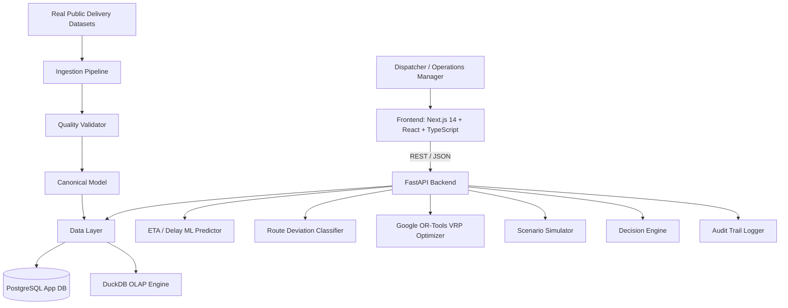

# System Architecture — Pathfinder--AI-Powered-Last-Mile-Delivery-Decision-Intelligence

## Architectural Principles

1. **Modular Monolith**: Simple, clean monorepo architecture avoiding unnecessary microservice overhead.
2. **Deterministic Optimization + ML Prediction**: ML predicts uncertain outcomes (delay, deviation probability); deterministic OR-Tools algorithms calculate exact optimal routes.
3. **No Synthetic Data in Production ML**: Models train and evaluate strictly on real-world historical delivery data.

## Component Flow Diagram

## Layer Breakdown

- **Frontend**: Next.js 14 App Router, TypeScript, Tailwind CSS, Recharts.
- **Backend API**: FastAPI, Async SQLAlchemy ORM, Pydantic V2 schemas.
- **Data Stores**: PostgreSQL 15 (relational application state) + DuckDB (OLAP analytical queries).
- **Optimization**: Google OR-Tools Routing Library (`pywrapcp`).
- **Machine Learning**: scikit-learn, Gradient Boosting Regressor, Random Forest Classifier.
